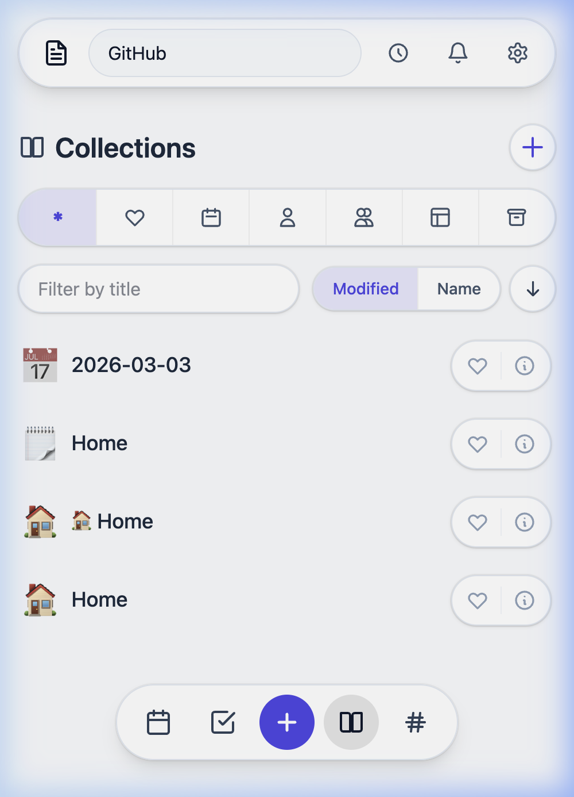
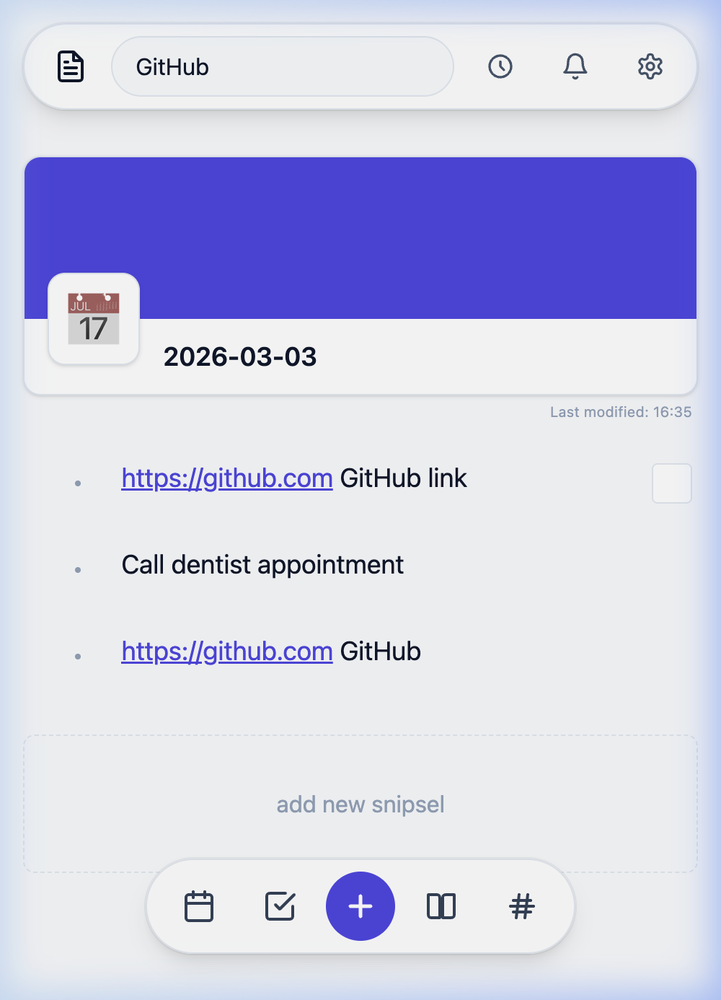
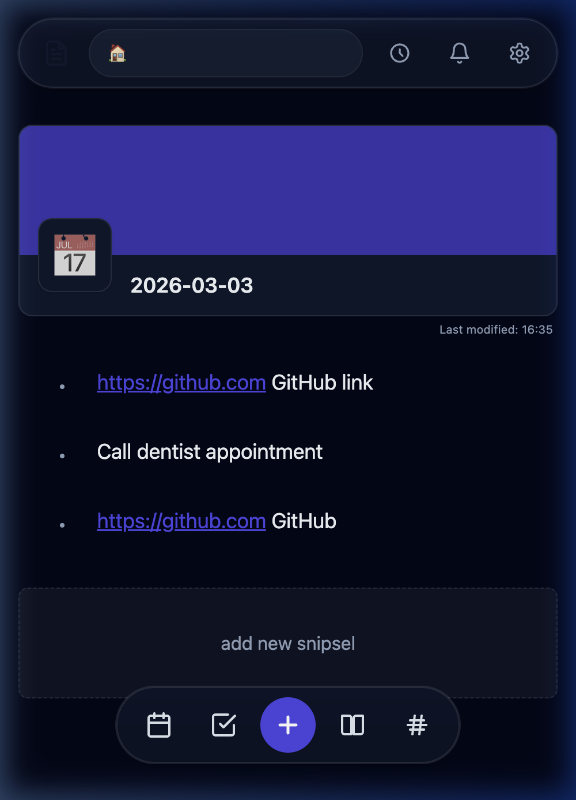
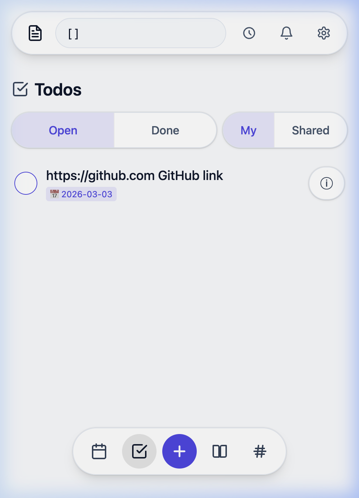
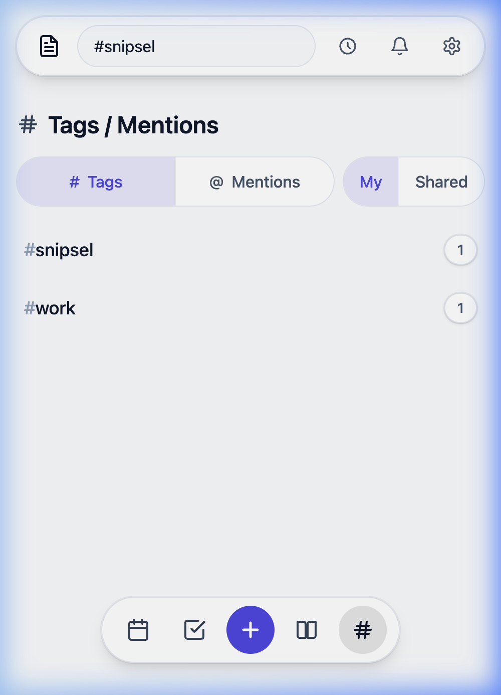
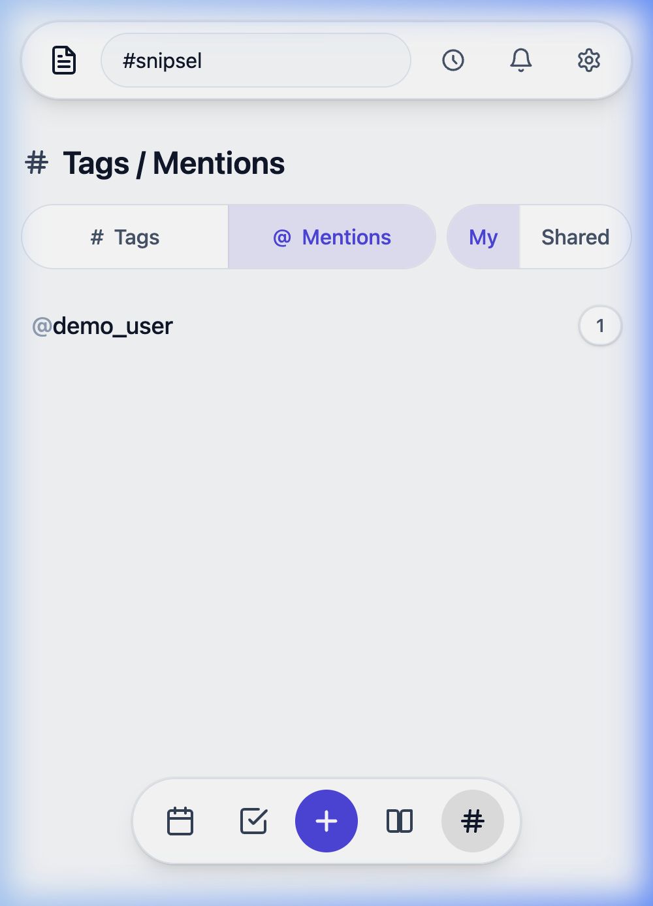
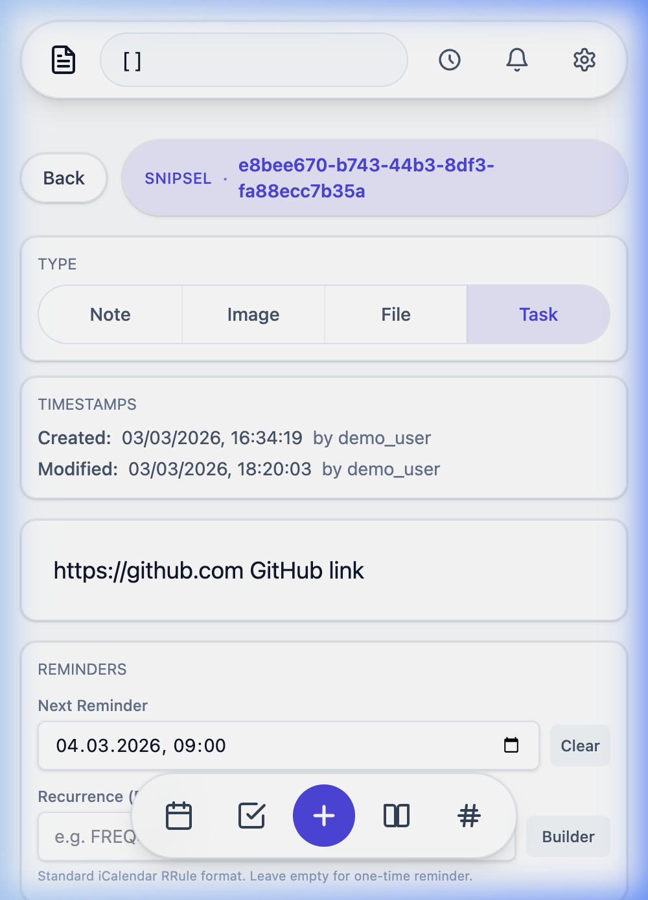
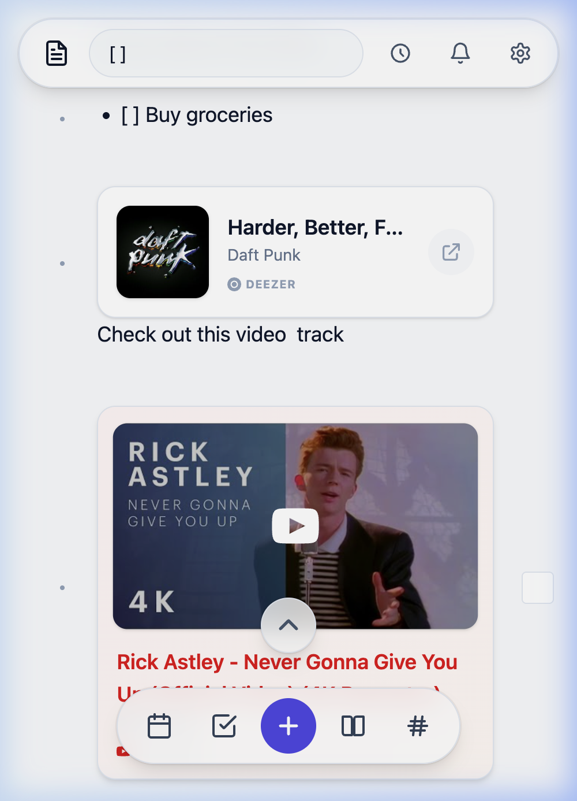
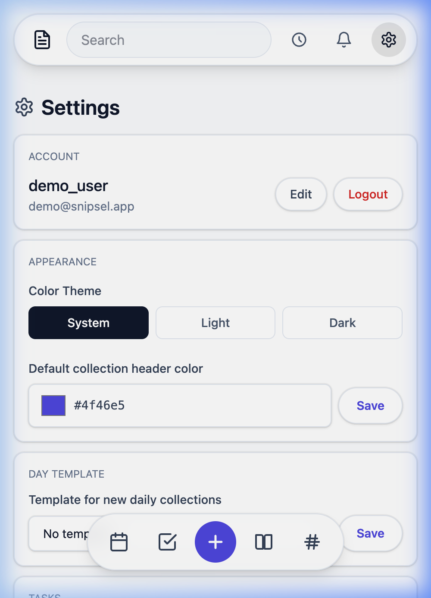
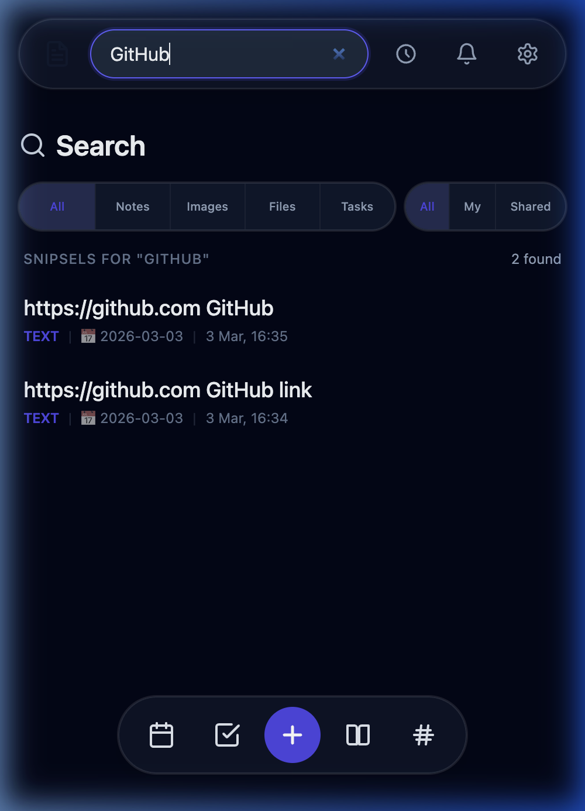

# 📓 Snipsel

**Your personal, self-hosted notes & tasks app — mobile-first, beautifully simple.**

Snipsel is an open-source PWA for capturing ideas, notes, tasks, bookmarks, and media — all in one place. No subscriptions, no cloud lock-in, runs on your own server in minutes.

<p align="center">
  
  &nbsp;
  
  &nbsp;
  
  &nbsp;
  
</p>
<p align="center">
  
  &nbsp;
  
  &nbsp;
  
  &nbsp;
  
</p>

---

## ✨ Why Snipsel?

Most note apps are either too simple (just plain text) or too heavy (Notion, Obsidian). Snipsel hits the sweet spot: structured collections, multiple content types, sharing, reminders — yet still feels as lightweight and instant as a sticky note.

### Comparison: Snipsel vs. Alternatives

| Feature | Snipsel | Standard Notes | Joplin | Notesnook |
| :--- | :---: | :---: | :---: | :---: |
| **PWA / mobile-first** | ✅ | ✅ | ⚠️ (1) | ✅ |
| **Images & Attachments** | ✅ | ✅ (2) | ✅ | ✅ |
| **Collection sharing** | ✅ | ✅ (2) | ✅ (3) | ✅ |
| **Daily journal / carry-over** | ✅ | ❌ (4) | ⚠️ (5) | ❌ (4) |
| **Passkey login** | ✅ | ✅ (2) | ❌ | ❌ |
| **Push notifications** | ✅ | ❌ | ✅ | ✅ |
| **Self-hosted (Container)** | ✅ | ✅ | ✅ | ✅ |
| **Import from Twos** | ✅ | ❌ | ❌ | ❌ |

1. **Joplin (PWA):** Joplin relies on native applications. There is no official web version or PWA that offers the full feature set without an installed client.  
2. **Standard Notes (Features):** Many of these features (Attachments, Sharing, Passkeys) are only available in the paid "Productivity" or "Professional" plans.  
3. **Joplin (Sharing):** Collaboration requires either "Joplin Cloud" (subscription) or a self-hosted "Joplin Server".  
4. **Standard Notes / Notesnook (Carry-over):** While daily notes can be created, there is no built-in system to automatically move unfinished tasks to the next day.  
5. **Joplin (Daily Journal):** Community plugins for "Daily Notes" exist, but task carry-over is not natively integrated and requires manual moving or complex scripts.


---

## 🚀 Features

### 📋 Collections & Snipsels
Organize everything in **collections** — from grocery lists to project notes. Each item inside is a **snipsel**, which can be one of six types:
- 📝 **Text** — plain notes with Markdown support
- ✅ **Task** — checkable to-dos with done tracking
- 🔗 **External link** — save URLs with labels
- 📎 **Internal link** — reference another snipsel
- 🖼️ **Image** — attach and view photos
- 📁 **File attachment** — store any file

### 📅 Daily Journal
A built-in **daily collection** auto-created for each day. Open tasks from the past 30 days are automatically **carried over** so nothing falls through the cracks.

### ⏰ Reminders & Recurrence
Set one-off or recurring reminders on any snipsel using the powerful **RRule recurrence** builder — daily, weekly, monthly, yearly, or fully custom intervals.

### 🔔 Push Notifications
Native browser push notifications keep you on top of reminders — even when Snipsel isn't open.

### 🤝 Sharing & Collaboration
Share any collection with other users in **read or write** mode. React to snipsels with emoji, @mention collaborators, and stay in the loop with an in-app notification feed.

### 🏷️ Tags & Mentions
Tag your snipsels with `#hashtags` and `@mention` people. Browse everything by tag or mention for instant filtering.

### 🤖 AI Integration
Process your notes with a built-in AI assistant. Configure your own OpenAI-compatible endpoint (OpenAI, Groq, Ollama) and use it to summarize, translate, or transform snipsels with custom prompts.

### 🔒 Security-first
- **Passkeys** (WebAuthn / FIDO2) — log in with Face ID, Touch ID, or a hardware key
- **TOTP 2FA** — standard authenticator app support
- **Passcode lock** — protect individual collections with a PIN
- **Password reset via email**
- **Registration toggle** — disable new user registration via environment variable

### 🎨 Beautiful & Adaptive UI
- Light, dark, or system-adaptive theme
- Custom accent color per collection
- Cover images for collections
- Installable as a PWA on any device

### 📥 Import from Twos
Coming from [Twos](https://www.twosapp.com/)? Snipsel can import all your lists, tasks, photos, and reminders with a single click — including recurrence rules.

<p align="center">
  
  &nbsp;
  
</p>

---

## 🐳 Quick Start (Docker)

```bash
docker run -d \
  --name snipsel \
  -p 5000:5000 \
  -v ./data:/app/data \
  -v ./uploads:/app/uploads \
  -e SNIPSEL_SECRET_KEY="your-secure-secret-key" \
  -e SNIPSEL_DOMAIN="yourdomain.com" \
  -e SNIPSEL_FRONTEND_URL="https://yourdomain.com" \
  -e SNIPSEL_REGISTRATION_ENABLED=1 \
  ghcr.io/mcfetz/snipsel:latest
```

That's it. Snipsel runs as a **single container** — no separate database server, no Redis, no complex setup.

Or with Docker Compose:

```bash
# Build the image
docker build -t snipsel .

# Run with compose
docker compose up -d
```

> **Note:** `SNIPSEL_DOMAIN` and `SNIPSEL_FRONTEND_URL` are required for Passkey authentication to work correctly.

---

## 🔧 Development

### Backend (Flask + SQLite)

#### Dependencies
- **FFmpeg**: Required for generating video thumbnails. Install it via your package manager (e.g., `brew install ffmpeg` on macOS or `sudo apt install ffmpeg` on Linux).

```bash
cd backend
python3 -m venv .venv
source .venv/bin/activate
pip install -r requirements.txt
pip install -e .

export SNIPSEL_SECRET_KEY="dev"
flask --app snipsel_api.app run --debug --port 5000

# Run database migrations
flask --app snipsel_api.app db upgrade
```

### Frontend (Svelte + Vite)

```bash
cd frontend
npm install
npm run dev
```

The frontend proxies `/api/*` to the backend in dev mode.

---

## ⚙️ Configuration

| Variable | Default | Description |
|---|---|---|
| `SNIPSEL_SECRET_KEY` | `dev` | Session secret — **change in production!** |
| `SNIPSEL_DATABASE_URL` | `sqlite:///snipsel.db` | Database URL |
| `SNIPSEL_UPLOAD_DIR` | `./uploads` | Directory for uploaded files |
| `SNIPSEL_MAX_UPLOAD_BYTES` | `10485760` | Max upload size (10 MB) |
| `SNIPSEL_DOMAIN` | `localhost` | Domain for Passkey auth |
| `SNIPSEL_FRONTEND_URL` | `http://localhost:5173` | Frontend URL for CORS & Passkeys |
| `SNIPSEL_REGISTRATION_ENABLED` | `1` | Set to `0` to disable new user registration |

**Optional SMTP (password reset):**

| Variable | Description |
|---|---|
| `SNIPSEL_SMTP_HOST` | SMTP server host |
| `SNIPSEL_SMTP_PORT` | SMTP port (default: `587`) |
| `SNIPSEL_SMTP_USERNAME` | SMTP username |
| `SNIPSEL_SMTP_PASSWORD` | SMTP password |
| `SNIPSEL_SMTP_USE_TLS` | Enable TLS (default: `1`) |
| `SNIPSEL_MAIL_FROM` | Sender address |
| `SNIPSEL_PUBLIC_BASE_URL` | If set, emails include a reset link |

**Optional VAPID (push notifications):**

| Variable | Description |
|---|---|
| `VAPID_PUBLIC_KEY` | VAPID public key |
| `VAPID_PRIVATE_KEY` | VAPID private key |
| `VAPID_SUBJECT` | e.g. `mailto:admin@yourdomain.com` |

---

## 🛠️ Tech Stack

- **Backend:** Python · Flask · SQLAlchemy · SQLite · Flask-Migrate
- **Frontend:** Svelte 5 · TypeScript · Vite · PWA (Service Worker)
- **Auth:** Session cookies · WebAuthn (Passkeys) · TOTP · bcrypt
- **Deployment:** Docker (multi-stage build) · single container (includes FFmpeg)

---

## 📄 License

MIT
